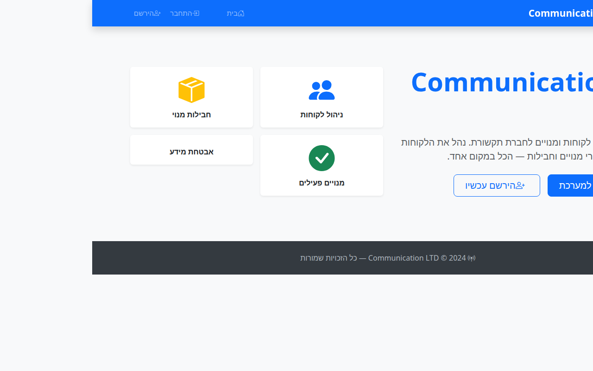
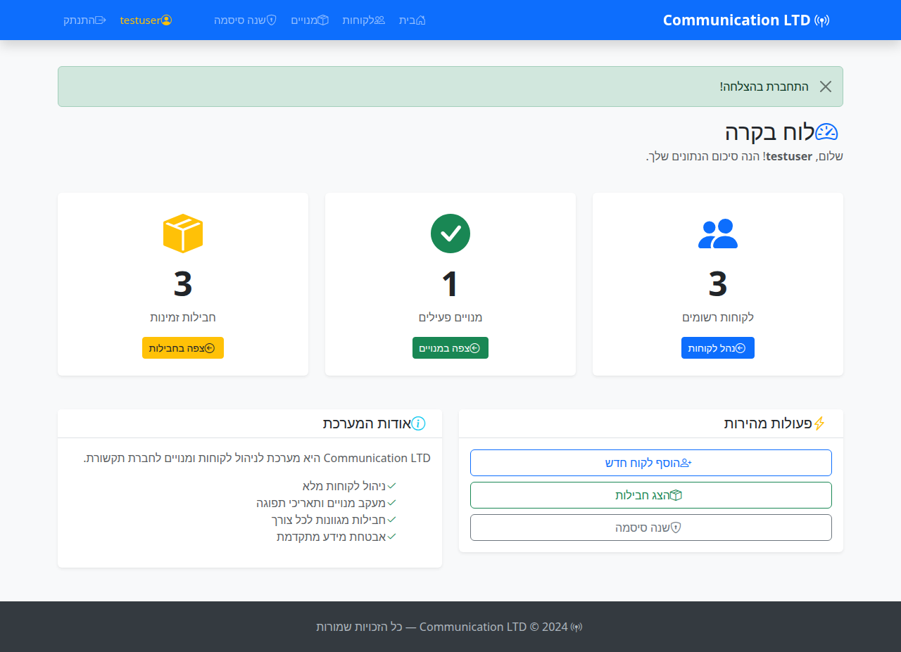
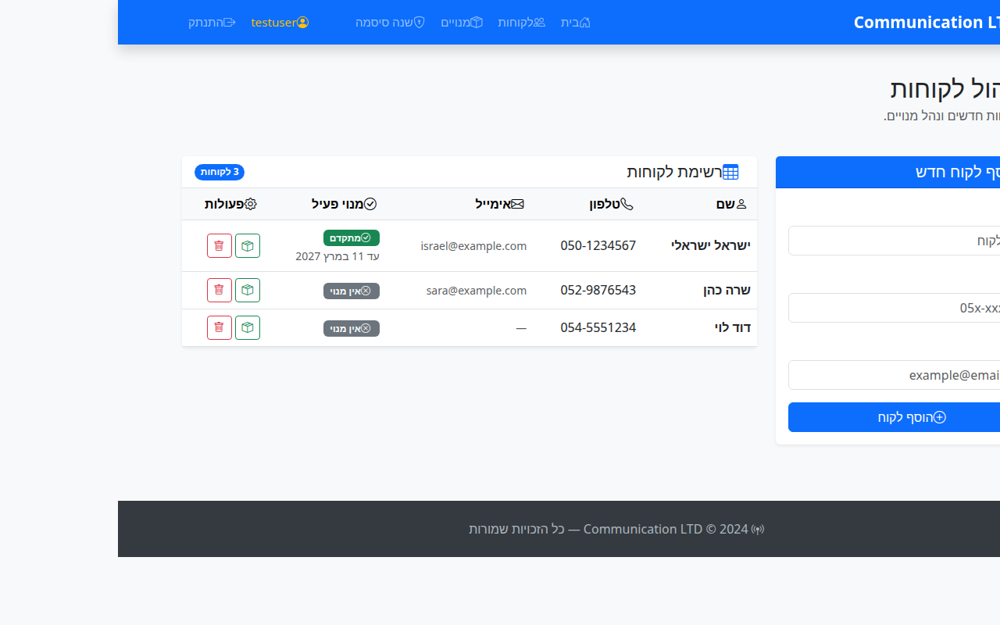
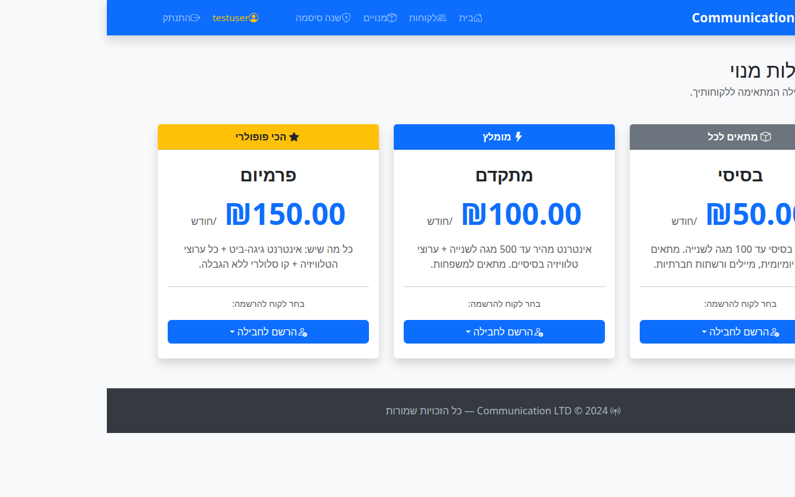

# Communication LTD

אפליקציית Django לחברת תקשורת — ניהול לקוחות, מנויים, חבילות, ואימות משתמשים.

---

## צילומי מסך

### דף בית — לא מחובר


### דף בית — מחובר (לוח בקרה עם סטטיסטיקות)


### ניהול לקוחות — טבלה עם מנויים ופעולות


### חבילות מנוי


### התחברות


### הרשמה


### שכחתי סיסמה


---

## תכונות

### ניהול לקוחות
- **הוספת לקוח** — שם, טלפון, אימייל (נשמר למודל)
- **מחיקת לקוח** — עם בדיקת בעלות (לא ניתן למחוק לקוח של משתמש אחר)
- **טבלת לקוחות** — Bootstrap table עם שם, טלפון, אימייל, מנוי פעיל, ופעולות

### חבילות ומנויים
- **3 חבילות מובנות** — בסיסי (₪50), מתקדם (₪100), פרמיום (₪150)
- **הרשמה לחבילה** — ניתן להרשים לקוח לחבילה ישירות מדף החבילות
- **מעקב מנויים** — תאריך התחלה ותפוגה, הצגת מנוי פעיל בטבלת הלקוחות

### אימות ואבטחה
- **התחברות / הרשמה / התנתקות**
- **שינוי סיסמה** — לוגין נדרש
- **איפוס סיסמה** — באמצעות טוקן בתפוגת שעה אחת (תוקן חלון תפוגה!)
- **ולידציה** — דרישות אבטחה לסיסמה (אורך, ספרות, אותיות, תו מיוחד)
- **CSRF protection** על כל הטפסים

### ממשק
- **Bootstrap 5** + **Bootstrap Icons** בכל הממשק
- **עברית RTL** מלא
- **לוח בקרה** — סטטיסטיקות (לקוחות, מנויים פעילים, חבילות)
- **Hero section** — לדף הבית לא-מחובר עם כפתורי כניסה/הרשמה
- **Footer** בכל הדפים

---

## תיקוני באגים שבוצעו

| בעיה | תיקון |
|------|-------|
| `email` בטופס לקוח לא נשמר למודל | הוסף שדה `email` ל-`Customer` + migration |
| טוקן איפוס סיסמה אף פעם לא פג תוקף | הוסף `token_created_at`, בדיקת שעה ב-`reset_password` |
| `Package` ו-`Subscription` קיימים בלי שימוש | נוספו views: `packages_view`, `subscribe_customer` |
| `system_screen` — רשימת `<ul>` בסיסית | שודרג לטבלת Bootstrap עם מנויים ופעולות |
| `home.html` — רק "ברוך הבא" | לוח בקרה עם סטטיסטיקות + hero section |
| `CustomerForm.save(user=...)` לא שימש לכלום | נותר `commit=False` + `customer.user = request.user` ב-view |

---

## מבנה הפרויקט

```
communication_ltd/    # הגדרות Django (settings, urls, wsgi)
users/
  ├── models.py       # User, Customer, Package, Subscription
  ├── views.py        # home, system_screen, customer_delete, packages_view, subscribe_customer, ...
  ├── forms.py        # CustomerForm (עם email), UserRegistrationForm, ...
  ├── urls.py         # כל נתיבי URL
  ├── migrations/     # כולל migration לנתוני חבילות ראשוניות
  └── templates/
      ├── base.html             # navbar עם Bootstrap Icons + footer
      ├── home.html             # לוח בקרה / hero section
      └── users/
          ├── system_screen.html    # טבלת לקוחות עם פעולות
          ├── packages.html         # כרטיסי חבילות
          ├── subscribe_confirm.html
          ├── login.html
          ├── register.html
          └── ...
manage.py
```

---

## נתיבי URL

| נתיב | תיאור | הרשאה |
|------|-------|-------|
| `/` | דף בית / לוח בקרה | פתוח |
| `/users/login/` | התחברות | פתוח |
| `/users/register/` | הרשמה | פתוח |
| `/users/logout/` | התנתקות | מחובר |
| `/users/change-password/` | שינוי סיסמה | מחובר |
| `/users/forgot-password/` | שכחתי סיסמה | פתוח |
| `/users/system/` | ניהול לקוחות | מחובר |
| `/users/system/delete/<pk>/` | מחיקת לקוח | מחובר + בעלות |
| `/users/packages/` | חבילות מנוי | מחובר |
| `/users/subscribe/<customer_pk>/<package_pk>/` | הרשמה לחבילה | מחובר + בעלות |
| `/admin/` | ממשק ניהול Django | Staff |

---

## הרצה

```bash
# 1. צור סביבה וירטואלית
python3 -m venv venv
source venv/bin/activate

# 2. התקן תלויות
pip install django

# 3. הגדר מסד נתונים (כולל נתוני חבילות ראשוניות)
python manage.py migrate

# 4. (אופציונלי) צור superuser
python manage.py createsuperuser

# 5. הפעל שרת
python manage.py runserver

# פתח http://localhost:8000
```

---

© Hila · Django Telecom Management Project

---

## 🇮🇱 תיעוד בעברית

### מה הפרויקט עושה

אפליקציית ווב מבוססת Django לניהול לקוחות של חברת תקשורת (ISP). המערכת מאפשרת לכל משתמש רשום לנהל את רשימת הלקוחות שלו — להוסיף, לצפות ולמחוק — ולהירשם לחבילות מנוי בתשלום חודשי. הממשק כתוב בעברית מלאה עם תמיכה ב-RTL.

**יכולות מרכזיות:**
- ניהול לקוחות — הוספה, הצגה ומחיקה עם בדיקת בעלות
- 3 חבילות מנוי מובנות: בסיסי (₪50), מתקדם (₪100), פרמיום (₪150)
- מעקב מנויים עם תאריכי התחלה ותפוגה
- לוח בקרה עם סטטיסטיקות בזמן אמת
- מערכת אימות מלאה: הרשמה, התחברות, שינוי סיסמה ואיפוס סיסמה בטוקן

### טכנולוגיות

| שכבה | טכנולוגיה |
|---|---|
| שפת תכנות | Python |
| מסגרת עבודה | Django |
| מסד נתונים | SQLite (ברירת מחדל של Django) |
| ממשק משתמש | Bootstrap 5 + Bootstrap Icons |
| כיוון טקסט | RTL מלא (עברית) |
| אבטחה | CSRF protection, ולידציית סיסמה, טוקן איפוס עם תפוגה של שעה |

### הוראות התקנה והפעלה

```bash
# 1. שכפל את הריפוזיטורי
git clone https://github.com/hilaln2210/communicationltd
cd communicationltd

# 2. צור סביבה וירטואלית והפעל אותה
python3 -m venv venv
source venv/bin/activate

# 3. התקן תלויות
pip install django

# 4. הגדר מסד נתונים (כולל נתוני חבילות ראשוניות)
python manage.py migrate

# 5. (אופציונלי) צור משתמש מנהל
python manage.py createsuperuser

# 6. הפעל את השרת
python manage.py runserver

# פתח בדפדפן: http://localhost:8000
```

### מבנה הפרויקט

```
communication_ltd/        # הגדרות Django (settings, urls, wsgi)
users/
  ├── models.py           # מודלים: User, Customer, Package, Subscription
  ├── views.py            # views: דף בית, ניהול לקוחות, חבילות, מנויים, אימות
  ├── forms.py            # טפסים: CustomerForm, UserRegistrationForm ועוד
  ├── urls.py             # כל נתיבי ה-URL של האפליקציה
  ├── migrations/         # migrations כולל נתוני חבילות ראשוניות
  └── templates/
      ├── base.html             # תבנית בסיס עם navbar ו-footer
      ├── home.html             # לוח בקרה / hero section למשתמש לא מחובר
      └── users/
          ├── system_screen.html    # טבלת לקוחות עם פעולות
          ├── packages.html         # כרטיסי חבילות מנוי
          ├── login.html
          ├── register.html
          └── ...
manage.py
```
