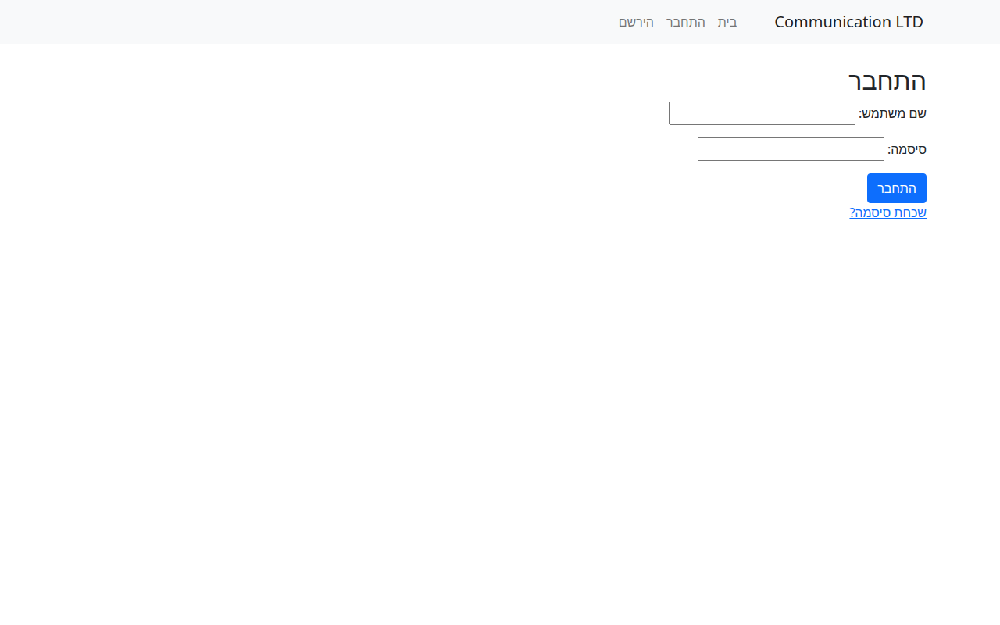
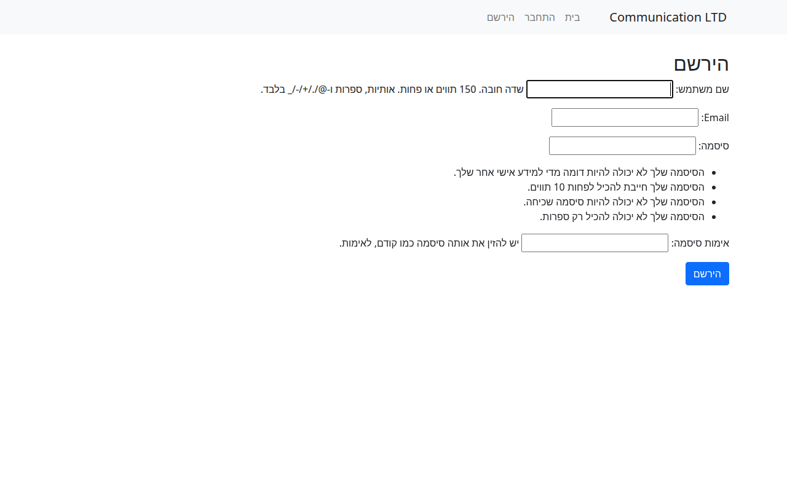
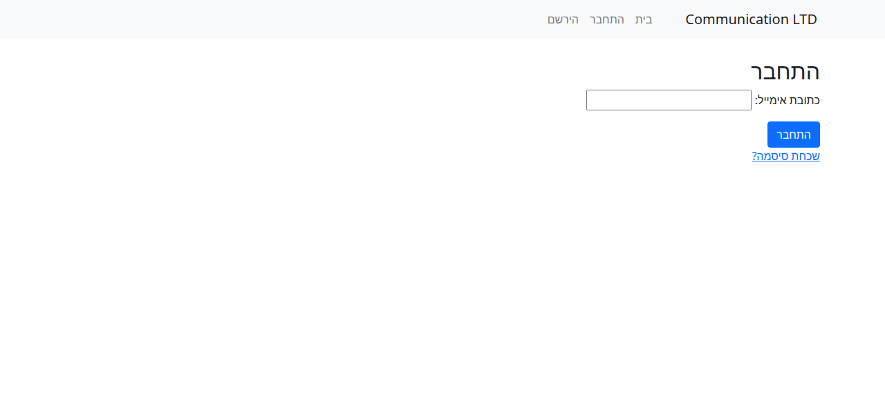

# Communication LTD

אפליקציית Django לחברת תקשורת — ניהול משתמשים עם התחברות, הרשמה, ואפס סיסמה.

## צילומי מסך

### התחברות


### הרשמה


### שכחתי סיסמה


---

## תכונות

- **התחברות** — שם משתמש + סיסמה, ולידציה מלאה
- **הרשמה** — שם משתמש, אימייל, סיסמה עם דרישות אבטחה
- **שכחתי סיסמה** — איפוס סיסמה באמצעות טוקן
- **ממשק ניהול** — Django Admin panel (`/admin/`)
- **אבטחה** — הגנה מפני brute force, CSRF protection
- **לוקליזציה עברית** — ממשק בעברית (RTL)

---

## טכנולוגיות

- **Python 3** · **Django**
- **SQLite** (ברירת מחדל)
- **Bootstrap** (UI)

---

## הרצה

```bash
# 1. צור סביבה וירטואלית
python3 -m venv venv
source venv/bin/activate   # Windows: venv\Scripts\activate

# 2. התקן תלויות
pip install django

# 3. הגדר מסד נתונים
python manage.py migrate

# 4. (אופציונלי) צור superuser לממשק ניהול
python manage.py createsuperuser

# 5. הפעל שרת
python manage.py runserver

# פתחי http://localhost:8000
# ממשק ניהול: http://localhost:8000/admin/
```

---

## מבנה הפרויקט

```
communication_ltd/    # הגדרות Django (settings, urls, wsgi)
users/                # אפליקציית משתמשים
  ├── models.py       # מודל משתמש
  ├── views.py        # views: login, register, logout, change/reset password
  ├── forms.py        # טפסים
  ├── urls.py         # נתיבי URL
  └── templates/      # תבניות HTML
manage.py
config.py
```

---

## נתיבי URL

| נתיב | תיאור |
|------|-------|
| `/` | דף בית |
| `/users/login/` | התחברות |
| `/users/register/` | הרשמה |
| `/users/logout/` | התנתקות |
| `/users/change-password/` | שינוי סיסמה |
| `/users/forgot-password/` | שכחתי סיסמה |
| `/users/system/` | מסך מערכת (למשתמשים מחוברים) |
| `/admin/` | ממשק ניהול Django |

---

© Hila · Django Academic Project
